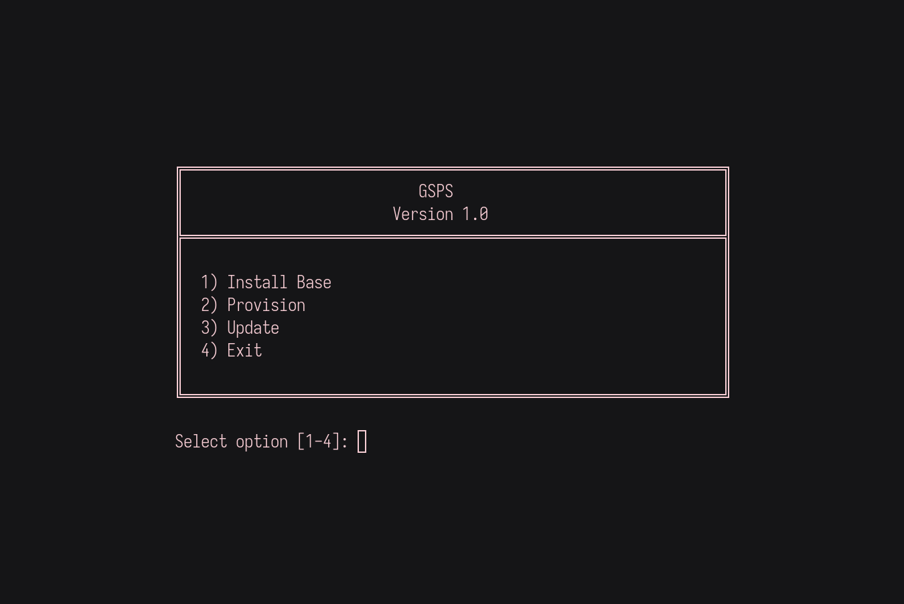

# GSPS - Gentoo System Provisioning Server


GSPS is a really fucked up tool. GSPS is a local gentoo mirror and provisioning endpoint that's installed with GSPS. 

Depending on your hardware, bootstrapping GSPS takes about 15-25 hours. Installs and provisioning are automated but usage still expects the user (literally just me) to have solid Gentoo fundamentals. 

# GSPS Technology Stack

## Core Operating System
- **Gentoo Linux**

## Web Server & Networking
- **Nginx**
- **fcgiwrap**

## Version Control & Synchronization
- **Git**
- **rsync**

## Package Management
- **Portage**


## Overview

With GSPS you can:
- Install GSPS
- Host a local mirror (portage tree + distfiles)
- Serve overlays and custom configs
- Deploy desktops, dev machines, servers, virtual machine packages etc.
- Manage packages and freeze versions across enviroments when needed for all gentoo machines in a network 


## Bootstrapping / Installing

Enviroment for the installation:
https://distfiles.gentoo.org/releases/amd64/autobuilds/20250615T163733Z/install-amd64-minimal-20250615T163733Z.iso

If starting from scratch, you must edit install scripts to use public Gentoo mirrors temporarily at scripts/install/base-base.sh'sync-uri' and 'GENTOO_MIRRORS' and the at configs/install.base-base.conf, STAGE3_URL to mirrors of your liking. Example mirrors below:

You should bootstrap the provisioner with itself or install it from itself so this guide goes pretty sour, kinda fast.
So heres what you got to do...

### Case 1: Bootstrap First GSPS (No Existing Server)

Edit `scripts/install/base-base.sh` and `configs/install/base-base.config` to use public Gentoo mirrors:

```bash
git clone https://github.com/gen2-acidking/GSPS
# Replace mirror URLs in base-base.sh
GENTOO_MIRRORS="http://distfiles.gentoo.org rsync://rsync.gentoo.org/gentoo-distfiles"
sync-uri = https://github.com/gentoo-mirror/gentoo.git
# And make sure that in configs/install/base-base.conf:
STAGE3_URL="https://distfiles.gentoo.org/releases/amd64/autobuilds/20250608T165347Z/stage3-amd64-openrc-20250608T165347Z.tar.xz"
```

Then install:
Edit `configs/install/base-base.conf` with Gentoo system configurations. The current configurations will produce a working system on a virtual machine. Change blockdev depending on your memory device. You might have to check this with `lslbk` 

```bash
# this installs a minimal gentoo system
# might take a couple hours on bad hardware.
cd GSPS/
chmod +x provision.sh
./provision.sh 
# choose: 1) Install Base -> 1) base-base
reboot

# clone the repo to your install aswell 
git clone https://github.com/gen2-acidking/GSPS
cd GSPS/
chmod +x init.sh
# depending on your internet/disk speeds about 15-25 hours
./init.sh --create
```

Later, revert mirror URLs to use the local GSPS server again. For the provisioning server it's [rsync or http]://localhost/[target]

### Case 2: You Already Have a Gentoo System

Turn it into a full GSPS:

```bash
cd
git clone https://github.com/gen2-acidking/GSPS
cd GSPS/
chmod +x init.sh
./init.sh --create
```

### Case 3: Provision New Provisioning Systems From Existing GSPS This is also just generally how the provisioner in used 
Boot a live CD and run:

```bash
cd
curl -fsSL http://gsps.local.address/provision.sh -o provision.sh
chmod +x provision.sh
./provision.sh
reboot
# choose: 1) Install Base -> 1) base-base
```
With install base option we can install base gentoo systems in the livecd, currently only on the gentoo livecd but if you make the 
/mnt/gentoo folder yourself it should work.  

After reboot:

```bash
cd
git clone https://github.com/gen2-acidking/GSPS
cd GSPS/
chmod +x init.sh
./init.sh --create
```


## Usage

```bash
./init.sh --test         # dry run, no downloads
./init.sh --create       # full setup (~600GB)
./init.sh --copy         # mirror existing provisioner
./provision.sh           # use the provisioner
```

## Features

- **Automated Installs**: base-base, vm-base, server-base, dev-env-base
- **Local Mirrors**: Portage tree (git/rsync), distfiles (GLEP 75), custom overlays
- **Provisioning Scripts**: DWM desktop, Samba server, self-replicating provisioner, language specific vm packages
- **Access via**: HTTP, rsync, git

## Directory Layout

```
/GSPS/gentoo-mirror/
├── provision.sh       # used to manage pakages on local systems
├── init.sh            # used to bootstrap or install GSPS
├── scripts/
│   ├── install/base-base.sh
│   └── provision/{dwm,samba,provision}-*.sh
├── configs/
│   └── install/base-base.conf
├── resources/
│   ├── tools/genfstab
│   ├── configs/       # doesn't exist yet
│   ├── patches/       # doesn't exist yet
│   └── packages/      # doesn't exist yet
├── distfiles/         # configured during install
├── portage/gentoo.git # configured during install
└── portage-rsync/     # configured during install
```

## Served Endpoints
In use you only need to call the provision.sh script to do anything with the server, 
- `http://init.sh`
- `http://config.sh`
- `http://overlayer.sh`
- `http://server/provision.sh`
- `http://server/scripts/install/base-base.sh`
- `http://server/configs/install/base-base.conf`
- `http://server/resources/tools/genfstab`
- `http://server/distfiles/...`
- `http://server/portage/gentoo.git`
- `http://server/overlays/acidking.git`

## License

[LICENSE](./LICENSE)
